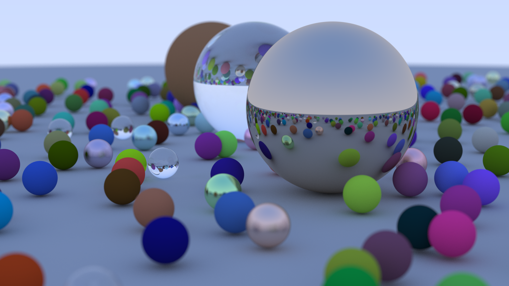
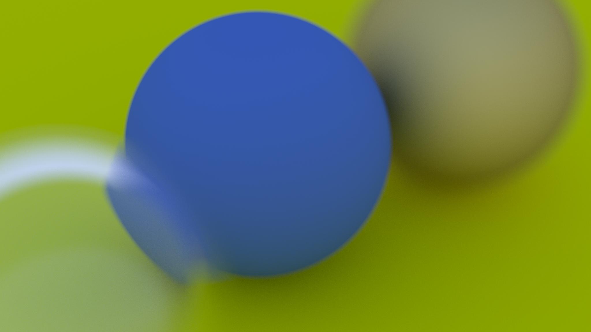
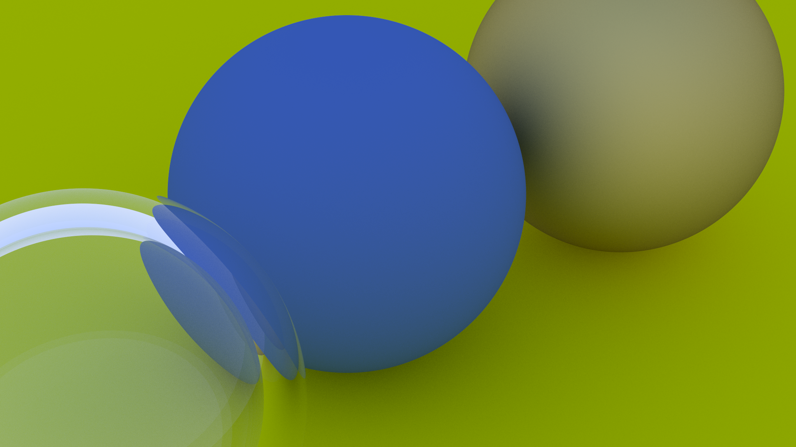
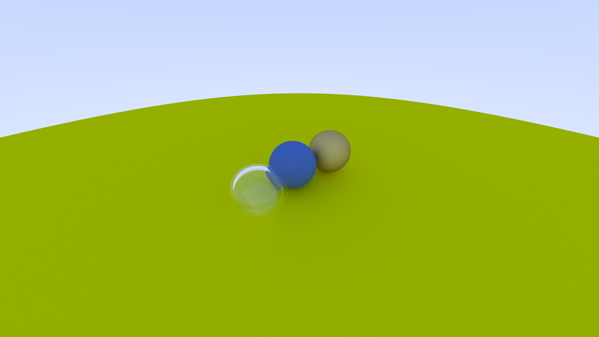
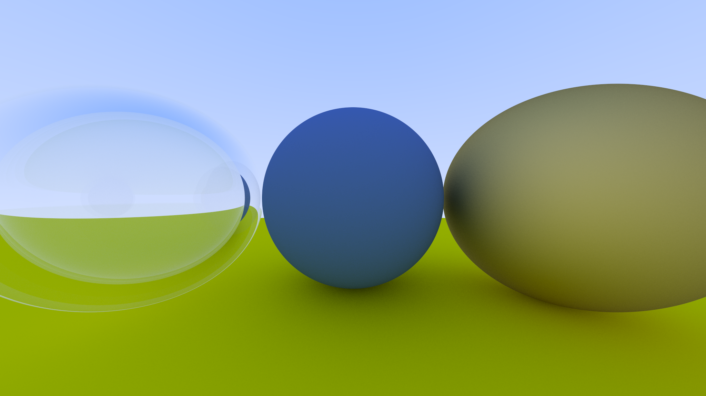

# Ray Tracing in One Weekend but in C
"Ray Tracing in One Weekend" by Peter Shirley, implemented in C by me. Code is written poorly, you have been warned.

## Images

<table>
    <tr>
        <th>Final Scene</th>
    </tr>
    <tr>
        <td></td>
    </tr>
</table>

<table>
    <tr>
        <th width="50%">Spheres with depth-of-field</th>
        <th width="50%">Zooming in</th>
    </tr>
    <tr>
        <td></td>
        <td></td>
    </tr>
</table>

<table>
    <tr>
        <th width="50%">A distant view</th>
        <th width="50%">A hollow glass sphere</th>
    </tr>
    <tr>
        <td></td>
        <td></td>
    </tr>
</table>

## Image settings
### All images shown has these settings
Image resolution:        2048x1152  
Image samples per pixel: 500  
Image max depth:         50  

## Time to render the final scene
```
$ time ./out > a.ppm

real    200m27.546s
user    199m11.541s
sys     0m2.528s
```
### Hardware used
Hardware: Laptop  
OS:       Fedora Linux 44  
CPU:      Intel Celeron N4000  
Memory:   2GB  
Storage:  500GB HDD

## Compilation
This compiles and generates the final scene image or the cover of the book:
```
$ git clone https://github.com/wickednvile/CRTIOW
$ cd CRTIOW
$ make
```
And simply open ```a.ppm``` with your favorite image viewer! If .ppm files are not supported on your image viewer try one online!
### NOTE
The program does not use any GPU or any third party libraries to speed up rendering. Just like in the book, it uses 1 core of your CPU which can take really long to compile.

## My thoughts
Implementing it in C was struggling for me. I had to cut corners on some parts because C didn't have certain features and I'm no expert on the language. As for the math/physics, I didn't understand everything cause I tried doing all this within a single week, some were also pretty hard and wasn't explained clearly in the book.  

Overall, a fun and challenging project. I learned a lot trying to get around the C++ code that was in the book and doing things my way, I do feel like I could have done better but whatever. I should study more ngl.

